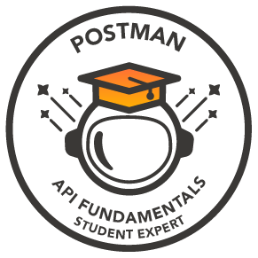

<div align="center">


<!-- Luffy GIF from repository -->


</div>


</div>

<!-- Real-time Status Dashboard -->
<table align="center">
<tr>
<td align="center">

```
╭─[ DEVELOPER STATUS ]─────────────────╮
│ 🧠 Mind: FOCUSED                     │
│ ⚡ Energy Level: ████████ 100%       │
│ 🔧 Current Stack: Next.js + Spring   │
│ 🌐 Deployment: CONTINUOUS            │
│ ☕ Coffee Status: ████████ FUELED    │
╰───────────────────────────────────────╯
```

</td>
<td align="center">

[](https://github.com/wzwzDev)
[](https://github.com/wzwzDev)

</td>
</tr>
</table>

---

## ⚡ TECH STACK MASTERY

### 🎯 FRONTEND DEVELOPMENT
<div align="center">


</div>

### 🔧 BACKEND DEVELOPMENT
<div align="center">


</div>

### 🗄️ DATABASE TECHNOLOGIES
<div align="center">


</div>

### ☁️ CLOUD & DEVOPS
<div align="center">


</div>

---

## 🏆 CERTIFICATIONS & ACHIEVEMENTS

<div align="center">

<a href="https://badgr.com/public/assertions/5vZPFCoyQZ6V2jTTQbq8lQ" target="_blank">
  
</a>
<a href="#" target="_blank">
  
</a>

</div>
---

## 📊 ADVANCED GITHUB ANALYTICS

<div align="center">

### 🔥 Core Statistics
<a href="https://github.com/wzwzDev">
  
</a>
<a href="https://github.com/wzwzDev">
  
</a>

### ⚡ Activity Metrics
<a href="https://github.com/wzwzDev">
  
</a>

### 📈 Contribution Graph
<a href="https://github.com/wzwzDev">
  
</a>

### 🏅 Achievement Showcase


### 🎯 Language Distribution (Detailed)


</div>

---
## 🌐 CONNECT WITH ME

<div align="center">

### 📡 Professional Network
[](https://linkedin.com/in/wael-louati)
[](https://your-portfolio.com)
[](https://github.com/wzwzDev)
[](mailto:waelwzwz@gmail.com)

</div>

---

## 🎯 CURRENT FOCUS

<div align="center">

```
╭─────────────── DEVELOPMENT ROADMAP ──────────────      ─╮
│                                                         │
│ 🔥 Building: NextJS + Angular + React + Spring Boot Apps          │
│ 📚 Learning: AWS Cloud Architecture & DevOps            │
│ 🎯 Seeking: Junior/Intern Full-Stack/Frontend/Backend Developer Roles    │
│ 🤝 Open to: Collaboration & Open Source Projects        │
│ 💡 Exploring: Microservices & System Design             │
│ ⚡ Passion: Creating scalable, user-friendly apps       │
│                                                         │
╰─────────────────────────────────────────────────────────╯
```


</div>

---

<details>
<summary>🔮 <strong>FUN FACTS ABOUT ME</strong></summary>

```
╔═══════════════ DEVELOPER PERSONALITY ═══════════════╗
║                                                     ║
║ 🧠 Thinks in: Multiple programming languages       ║
║ ☕ Powered by: Coffee & continuous learning         ║
║ 🎵 Codes to: Lo-fi beats & focus music             ║
║ 🌙 Peak hours: Early morning & late evening        ║
║ 🦄 Spirit animal: Persistent problem solver        ║
║ 🎮 Philosophy: Every bug is a learning opportunity ║
║ 🍕 Debugging fuel: Good food & positive vibes      ║
║ 💭 Believes: Clean code is a love letter to future ║
║ 🚀 Goal: Building applications that make a impact  ║
║                                                     ║
╚═════════════════════════════════════════════════════╝
```

</details>

---

<div align="center">

## ⚡ DEVELOPER SIGNATURE

```
╔══════════════════════════════════════════════════════════════════════════════════════╗
║                                                                                      ║
║     🌟 "CODE IS THE CLOSEST THING WE HAVE TO SUPERPOWERS" 🌟                        ║
║                                                                                      ║
║                   Thank you for visiting my GitHub profile!                          ║
║                                                                                      ║
║                                                                                      ║
╚══════════════════════════════════════════════════════════════════════════════════════╝
```

</div>
